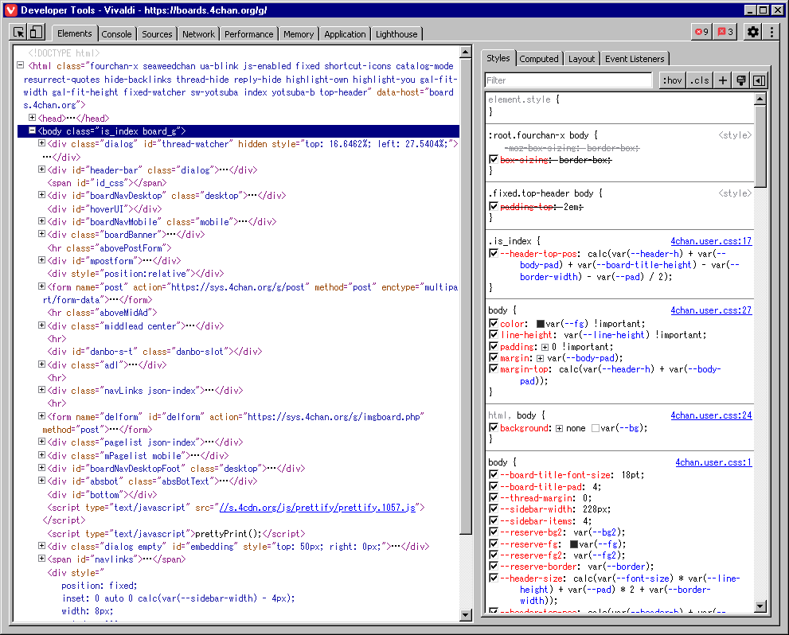

# Chrome DevTools

## Installation
1. Visit DevTools settings > Experiments > Allow extensions to load custom stylesheets
2. Go to chrome://extensions and check "Developer mode"
3. Click on "Load unpacked" and choose "dist/chrome-devtools" from this repo.

## Caveats
- DevTools features extensive utilisation of [Shadow DOM](https://developer.mozilla.org/en-US/docs/Web/API/Web_components/Using_shadow_DOM). That is the cause for the following problems:
  - Some elements (in particular, custom ones) may not be styled at all.
  - The theme can not be used anywhere else without the `applyStyleSheet` API, with the only way remaining to inject JS.
- Some expanding buttons do not work, as it's hard to track where they expect the mouse to be.
- Last version tested is Chrome 109.

These reasons make it very hard to maintain, so it may not be updated frequently.

## Preview

