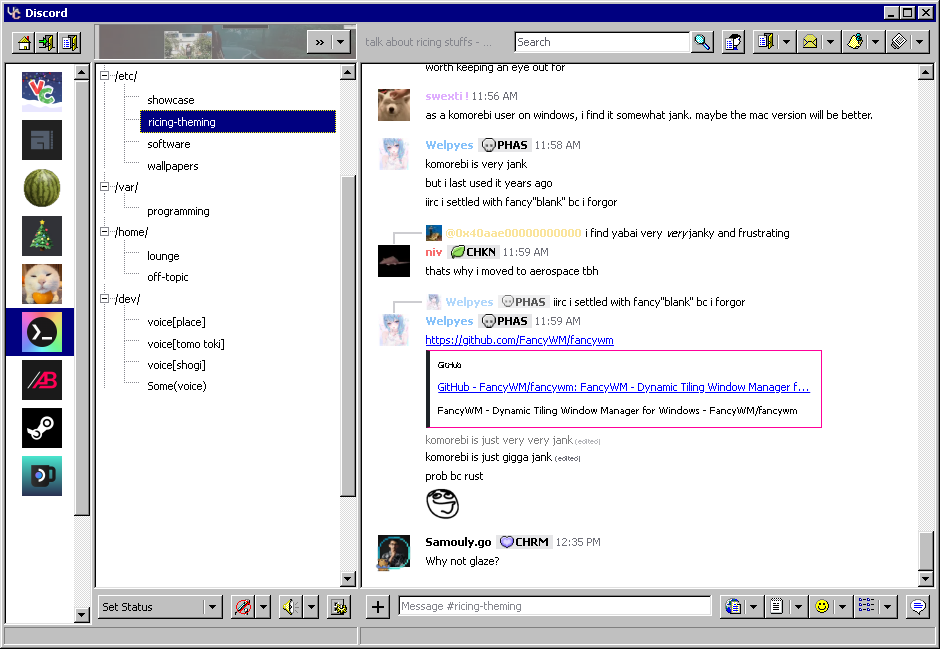

# Discord

## Usage

0. Install Vencord/Vesktop.
1. Open the Settings > Themes > "Online Themes" tab.
2. Copy & paste the following into the text box:

   ```
   https://raw.githubusercontent.com/ricewind012/win95-themes/refs/heads/dist/dist/discord.css
   ```

   If you wish to use other colors, paste one of these links into the text box:

   ```
   https://raw.githubusercontent.com/ricewind012/win95-themes/refs/heads/master/src/shared/colors/hotdogstand.css
   https://raw.githubusercontent.com/ricewind012/win95-themes/refs/heads/master/src/shared/colors/vgui.css
   https://raw.githubusercontent.com/ricewind012/win95-themes/refs/heads/master/src/shared/colors/win2000.css
   ```

## Caveats

- Icons are locked behind the "English (US)" locale (change in Settings > Language).
- Sidebar list items are huge due to rendering issues with lazy-loading.

## Preview


