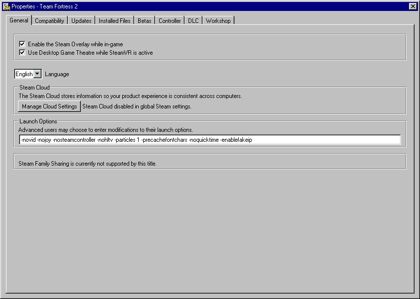

# Steam

## Usage
1. Install [SFP](https://github.com/PhantomGamers/SFP).
2. [Download](https://github.com/ricewind012/win95-themes/archive/refs/heads/master.zip) the repository.
3. Unarchive the downloaded file in `~/.steam/steam/steamui`.
4. Launch SFP and select `win95-themes` as the skin.

## Preview

