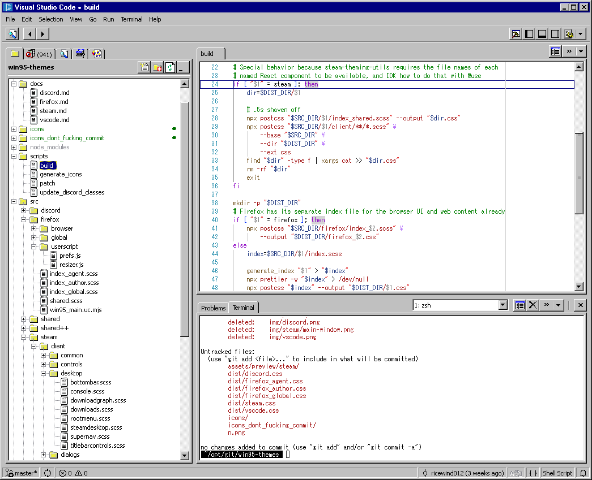

# Visual Studio Code

Last tested version is [1.106](https://code.visualstudio.com/updates/v1_106)!

## Usage

1. Install the [Custom UI Style](https://open-vsx.org/vscode/item?itemName=subframe7536.custom-ui-style) extension.
2. Add to `settings.json` (Preferences: Open User Settings (JSON)) the following:

```jsonc
"custom-ui-style.external.imports": [
	"file:///path/to/win95-themes/dist/vscode.css",
	"file:///path/to/win95-themes/src/shared++/ElementUtils.js",
	"file:///path/to/win95-themes/src/vscode/vscode.js",

	// If you wish to use other colors, uncomment one of the lines below:
	//"file:///path/to/win95-themes/src/shared/colors/hotdogstand.css",
	//"file:///path/to/win95-themes/src/shared/colors/vgui.css",
	//"file:///path/to/win95-themes/src/shared/colors/win2000.css",
],

"editor.scrollbar.arrowSize": 16,
"editor.scrollbar.vertical": "visible",
"editor.scrollbar.verticalHasArrows": true,
"editor.scrollbar.horizontalHasArrows": true,

"terminal.integrated.cursorStyle": "underline",
"terminal.integrated.fontFamily": "MS Gothic",
"terminal.integrated.fontSize": 12,

"window.titleBarStyle": "native",
"window.dialogStyle": "custom",
"window.menuStyle": "custom",

"workbench.activityBar.location": "top",
"workbench.editor.tabSizing": "shrink",
"workbench.editor.wrapTabs": true,
//"workbench.list.horizontalScrolling": true,

"breadcrumbs.enabled": false,
"explorer.compactFolders": false,
"editor.roundedSelection": false,
```

3. Run the `scripts/patch vscode` script. Optional, makes the tree items' height smaller.

4. If you did step 3, install the [Fix VSCode Checksums Next](https://marketplace.visualstudio.com/items?itemName=RimuruChan.vscode-fix-checksums-next) extension, then execute the "Fix Checksums: Apply" command.

   The extension is not available on Open VSX, so install it from VSIX here: https://marketplace.visualstudio.com/_apis/public/gallery/publishers/RimuruChan/vsextensions/vscode-fix-checksums-next/latest/vspackage.

## Caveats

- [Scrollbars arrows](https://github.com/microsoft/vscode/issues/130616#issuecomment-1076061821) are undocumented and may be removed at any time.
- Scrollbars move out of bounds when scrolling to the bottom.
- Some icons are absent.

## Preview


