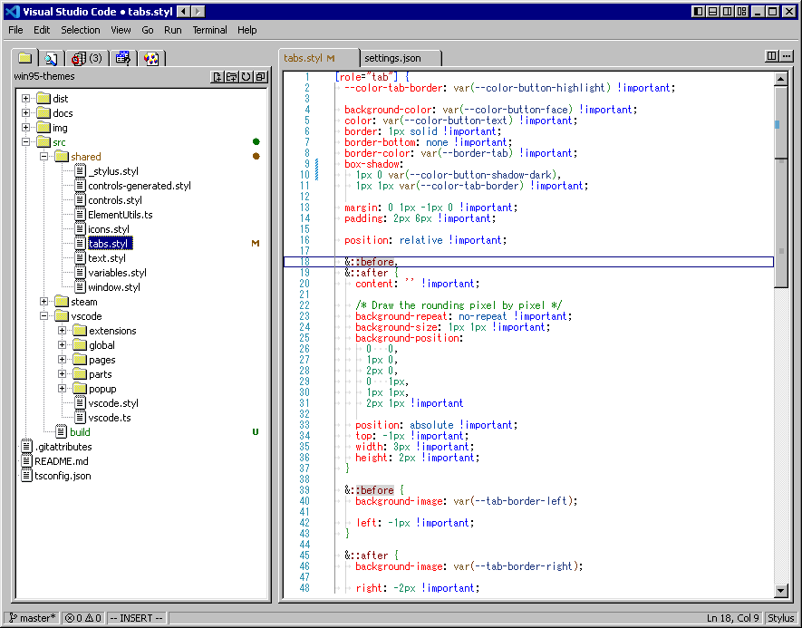

# Visual Studio Code

Last tested version is [1.92](https://code.visualstudio.com/updates/v1_92)!

## Usage

1. Run the `scripts/patch_vscode` script. Optional, makes the tree items' height smaller.
2. Install the [Custom UI Style](https://open-vsx.org/vscode/item?itemName=subframe7536.custom-ui-style) extension.
3. Add to `settings.json` (Preferences: Open User Settings (JSON)) the following:

```json
	"custom-ui-style.external.imports": [
		"file:///path/to/win95-themes/dist/vscode.css",
		"file:///path/to/win95-themes/src/shared++/ElementUtils.js",
		"file:///path/to/win95-themes/src/vscode/vscode.js",
	],

	"editor.scrollbar.arrowSize": 16,
	"editor.scrollbar.vertical": "visible",
	"editor.scrollbar.verticalHasArrows": true,
	"editor.scrollbar.horizontalHasArrows": true,

	"terminal.integrated.cursorStyle": "underline",
	"terminal.integrated.fontFamily": "MS Gothic",
	"terminal.integrated.fontSize": 12,

	"window.titleBarStyle": "native",
	"window.dialogStyle": "custom",
	"window.menuStyle": "custom",

	"breadcrumbs.enabled": false,
	"workbench.editor.tabSizing": "shrink",
	"workbench.editor.wrapTabs": true,
```

## Caveats

- [Scrollbars arrows](https://github.com/microsoft/vscode/issues/130616#issuecomment-1076061821) are undocumented and may be removed at any time.
- Editor and scrollbars may move out of bounds.
- Some icons are absent.

## Preview


